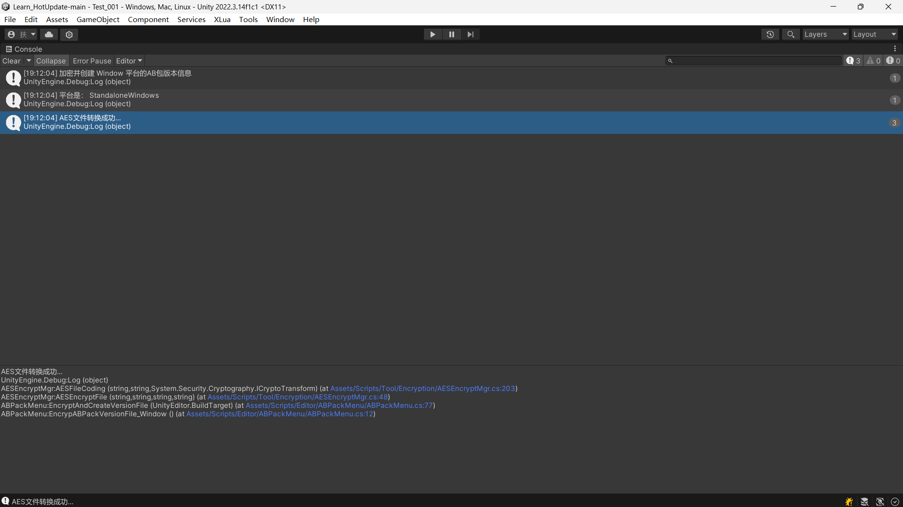
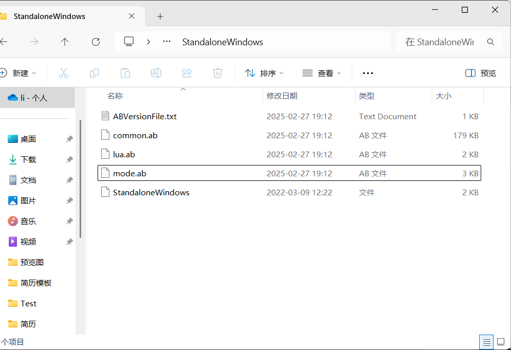

[toc]
****
# Assetbundle打包过程如何防止循环依赖？
**1.首先要清楚什么是循环依赖**
指两个或多个AssetBundle互相依赖，比如A依赖B，B又依赖A，这种情况下会导致打包和加载时出现问题。

**2.循环依赖的本质是什么**
是资源之间的依赖关系没有被正确地管理和划分。如果两个AssetBundle互相依赖，那说明它们的资源关系没有被清晰地分离。所以，解决这个问题的关键应该是如何合理地划分AssetBundle，避免资源之间的交叉依赖。

**3.解决方案**
- 第一个方向是“**合理划分AssetBundle**”。
    比如，把公共的资源（比如材质、贴图）单独放到一个AssetBundle中，其他AssetBundle只依赖这个公共包，而不是互相依赖。这个方法听起来很合理，但实际操作中可能会遇到一些问题，比如如何定义“公共资源”？如果划分得不够清晰，还是可能导致循环依赖。所以，这个方法需要结合具体的项目需求来实施。
- 第二个方向是“**使用工具检测依赖关系**”。
    用工具来分析资源之间的依赖关系，就能提前发现问题。比如，Unity自带的**AssetBundleManifest**可以**用来查看依赖关系**，还有一些第三方工具，比如**UWA检测工具**，可以**更详细地分析资源的打包情况**。但它本身并不能解决问题，只是提供了一个辅助手段。
- 第三个方向是“**调整打包设置**”。
    比如，可以启用“**Non-Recursive Dependency Calculation**”选项，这样可以避免Unity在计算依赖关系时陷入循环。不过，这个方法可能会有一些副作用，比如某些循环依赖可能无法被正确加载。所以，这个方法需要谨慎使用，最好结合其他方法一起使用。

******

# AssetBundle这个项目具体做了什么

**主要有三个部分**

- **根据一个xml文件(BuildSetting)，然后进行一个打包的处理。其作用为:**
  1.按功能划分资源
    - 如UI、Shader、Model等,便于管理和加载。
  
  2.打包策略控制
    - File模式适用于需要单独加载的大资源（如背景图）。
    - Directory模式适用于关联性强的小资源（如图集、模型相关文件）

  3.后缀过滤
    - 避免将无关文件（如.meta）打入AssetBundle，减少包体积。

- **进行一个加载卸载的逻辑管理**
  
- **热更新管理**
    进行资源对比，然后再进行下载。实现热更新

****

# AssetBundle怎么进行加载和卸载的
项目采用了一个专门的资源管理器来统一处理

  **1.资源管理器**
    该管理器是整个资源管理系统的核心，负责加载、卸载以及维护资源的状态。
    内部维护了一个字典,其键是资源的路径,而值则是对应的ab资源对象

  **2.资源封装类**
    将每个AB资源封装成一个类,该类不仅包含AB对象本身，还维护了一个引用计数，用于记录资源被引用的次数。
    引用计数的作用是确保AB资源在仍有模块使用时不会被错误地卸载，当引用计数为0时，表示资源不再被使用，可以安全卸载。

  **3.加载逻辑**
    当需要加载一个AB资源时，管理器首先检查字典中是否已经存在该资源。
    如果资源已存在，直接返回该资源，并将引用计数加1。
    如果资源不存在，则直接加载AB资源,并将其存储到字典中，同时设置引用计数为1。

  **4.卸载逻辑**
    卸载时，调用管理器的卸载方法，传入资源的唯一标识。
    管理器找到对应的资源封装类，将引用计数减1。
    如果引用计数为0，则将该资源添加到一个卸载队列中，等待下一帧的更新时进行实际的卸载操作。
    在更新时处理卸载队列，卸载资源，并从字典中移除该资源的记录。

****

# AssetBundle卸载的时机和方式
  **AssetBundle.Unload(flase)** 是释放 AssetBundle 文件的内存镜像，不包含Load创建的Asset内存对象。
  **AssetBundle.Unload(true)** 是释放 AssetBundle 文件内存镜像和并销毁所有用Load创建的Asset内存对象。

****

# AB包的打包策略

我将功能逻辑紧密相关的资源打包到一个AB包中。例如，一个游戏场景中的角色模型、贴图、动画等资源会被组合成一个包。这样可以确保在加载该场景时，所有相关的资源能够一次性高效地加载完成，减少不必要的依赖关系和加载次数，提高资源加载的效率。

****

# 压缩格式,直接就是Lz4和LzMA(为什么不选LzMA?)

- **Lz4**
  首先Lz4相比于LzMA的压缩速度快10倍左右,但是平均压缩比例会比LzMA差30%左右,所以Lz4的包体可能会更大一些,再加上Lz4的算法开源

- **LzMA**
  因为LzMA解压和读取速度都会非常慢并且占大量内存,因为不是ChunkBased(分块解压)，而是Stream(流式解压)，因为分块解压每次解压可以重用之前的内存，减少内存的峰值。
  - 流式解压:
    - 将压缩数据视为一个连续的数据流，必须从头到尾完整解压才能使用。
  - 分块解压:
    - 将数据分割为多个独立的块（Chunk），每个块单独压缩。解压时可以按需逐块加载和解压。
  
- **AssetBundle压缩的大小和数量**
  AssetBundle分两部分，一部分是头（用于索引），一部分是实际的打包的数据部分。如果每个Asset都打成一个AssetBundle，那么可能头的部分比数据还大。

****

# AssetBundle内部结构是什么?
- **这是问的ab包数据本身**
    结构: **包头** + **资源本身**
  - **包头**: 包含有关AssetBundle的信息，比如标识符、压缩类型和内容清单。清单是一个以Objects name为键的查找表。每个条目都提供一个字节索引，用来指示该Objects在AssetBundle数据段的位置

****

# 为什么不能把ab包资源压缩到Resource里
- **首先什么是Resource?**
  这里的Resource不是指资源,而是指Unity中的**Resource文件夹系统**
  - Unity 会将 Assets/Resources 文件夹及其子文件夹中的所有资源打包到最终的应用程序中。
  - 为了快速检索这些资源，Unity 在构建时会为 Resources 文件夹中的内容生成一个红黑树（R-B Tree）索引。

  所以Resource越大，红黑树越大，它不可卸载，并在刚刚加载游戏的时候就会被一直加在内存里，极大的拖慢游戏的启动时间

- **回到问题本身**
  都放在Resource里游戏会很大

****

打开服务器,修改测试用Lua文件内容,以下为修改后内容
```Lua
print("Hello World!123")
```
```Lua
print("Test New123")
```

Tools -> AB包加密 -> 创建AB包版本文件 -> Window 版本,控制台输出

输出在AssetBundlesEncrypt,将其复制并替换到Net Box Server/Test/Web,以下是AssetBundlesEncrypt更新后的文件夹内容


还原两个文件 -> Generate Code -> hotfix Inject In Editor -> 运行,还原如下
```Lua
print("Hello World!")
```
```Lua
print("Test New")
```
热更文件下载到C:\Users\asus\AppData\LocalLow\DefaultCompany\Learn_HotUpdate1

