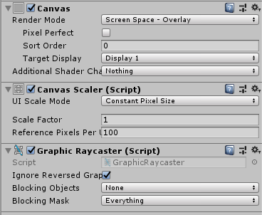
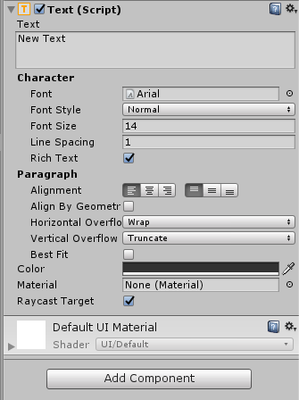
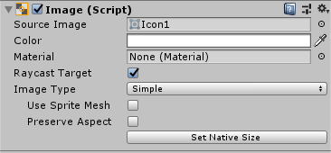
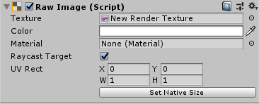
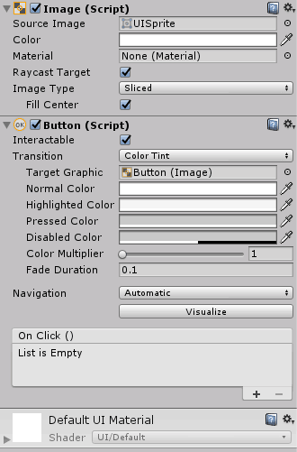
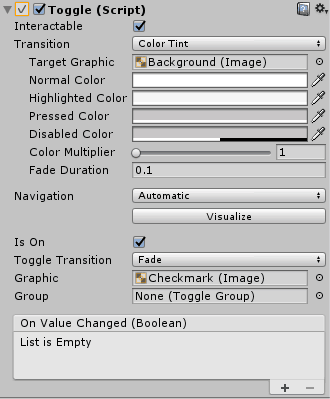
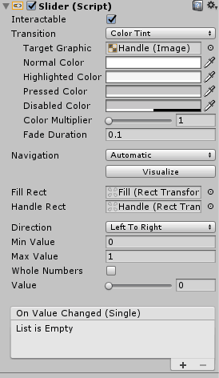
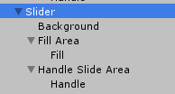
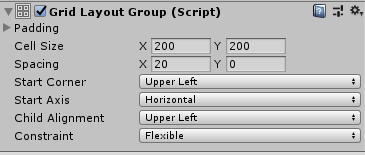
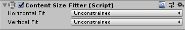

[toc]

****
# UGUI基本控件
****
## 1.Canvas---画布
每当你创建一个UI物体的时候,Canvas都会自动创建,所有UI元素都必须是Canvas的子物体
和Canvas一同创建的还有一个EventSystem,其是一个基于Input的事件系统,可以对键盘、触摸、鼠标、自定义输入进行处理。
<center>

  

</center>

!!! important 三种渲染模式
    **1. Screen Space - Overlay（屏幕空间 - 覆盖）**
    - 这是最常用的模式，UI 元素直接渲染在屏幕最上层，会覆盖 3D 场景和其他元素
    - 适用场景：
        - 游戏中的 HUD（heads-up display，平视显示器），如生命值、得分、小地图等
        - 菜单界面，如主菜单、设置菜单、暂停菜单
        - 不需要任何类不需要与 3D 场景交互的 2D 界面元素
    - 优点：设置简单，UI 会自动适应屏幕分辨率，不需要考虑相机位置

    **2. Screen Space - Camera（屏幕空间 - 相机）**
    - UI 元素被渲染在指定相机前方的一个平面上，会受到相机影响
    - 适用场景：
        - 需要在 3D 场景和 UI 之间插入元素的情况
        - 希望 UI 有透视效果或轻微的 3D 感
        - 需要 UI 受到相机裁剪影响的情况
        - 例如：3D 游戏中的交互提示面板、对话气泡等
      
    **3. World Space（世界空间）**
    - UI 元素作为 3D 空间中的实体存在，可以像位置、旋转和缩放
    - 适用场景：
        - 3D 场景中的交互界面，如电脑屏幕、控制面板
        - VR/AR 应用中的虚拟界面
        - 角色头顶的名字或状态显示
        - 3D 空间中的公告牌、提示牌
    - 优点：可以与 3D 场景完全融合，实现沉浸式的 UI 体验

### 设置描述
$\color{Pink}{\text{Render Mode}}$

- Screen Space - Overlay：让UI始终位于界面最上面部分
- Screen Space - Camera：赋值一个相机，按照和相机的距离前后显示物体和UI
- World Space：让画布变成一个3D物体可以移动等

$\color{Pink}{\text{UI Scale Mode}}$
- Constant Pixel Size：根据像素大小计算UI位置和尺寸。当屏幕尺寸改变时，UI大小不会变而其他物体会变。
- Scale With Screen Size：根据不同屏幕尺寸自动改变UI大小
- Constant Physical Size：根据物理

$\color{Pink}{\text{Graphic Raycaster}}$
- Ignore Reversed Graphic：图片翻转后点击无效
- Blocking Objects：阻挡点击物体(当UI前面有物体时，点击前面的物体射线是否阻挡)
- Blocking Mask：阻挡层级

**原理**
输入系统的图形碰撞测试组件，它并不会检测Canvas以外的内容，检测的都是画布下的元素。当图元素上存在有效的碰撞体时，Graphic Raycaster 组件会统一使用射线碰撞测试来检测碰撞的元素。
我们也可以设置完全忽略输入的方式来彻底取消点击响应，也可以指定阻止对某些layers进行相应。

首先UGUI是在3D网格下建立起来的UI系统，它的每个可显示的元素都是以3D模型网格的形式来构建起来的。当UI被实例化时，UGUI首先要做的事就是构建网格。也就是说当Unity3D制作一个图元，或者一个按钮，或者一个背景时，都会先构建一个方形网格，再将图片放入网格中。可以理解为制造了一个3D模型，用一个网格绑定一个材质球，材质球里存放了要显示的图片。

如果每个元素都会生成一个模型并且绑定一个材质球存入一张图片的话，UI上成千上百个元素就会拥有成千上百个材质球，以及成千上百张图。这样使得引擎在渲染时都需要读取成千上百张图，对每个材质球和网格都进行渲染，这会导致性能开销巨大，drawcall过高，可以简单的理解为一个材质球一个drawcall。

UGUI当然做了优化，它将一部分相同类型的图片都集合起来合成一个张图，然后将拥有相同图片相同shader的材质球合并成一个材质球，并且把分散开的模型网格也一起合并了，这样就生成了几个大网格和几个材质球，以及少许整张的图集。节省了很多材质球，图片，网格的渲染，UI的效率更高了很多，游戏在进行时才会顺畅。这就是我们常常在UI制作中提到的图集的概念，它把很多张图片都放置在一张图集上，导致大量的图片和材质球不需要重复的绘制，只要改变模型顶点上的uv即可。

UGUI也并不是所有的网格和材质球都合并成一个，只有把相同层级的元素，以及相同层级上的拥有相同的材质球参数的才合并在一起。合并成一个网格了就是一个静止的模型了，如果我们移动了任何元素，或者销毁了任何元素，或者改变了任何元素的材质球参数，UGUI则会销毁这个网格，重新构建一个新的。我们设想下，如果我们每时每刻都在移动一个元素的话，UGUI就会不停的拆分合并拆分合并，就会不停的消耗CPU，来使得画面保持应该有的样子。

因为这些合并和拆分的操作会消耗很多CPU，UI系统要做的就是尽一切可能节省些CPU消耗，把尽量多的剩余CPU让给项目逻辑。UGUI在制作完成成品后性能优劣差距很多时候都会出现在这里，合并的最多的元素，拆分次数最少的UI，才能达到优秀的性能开销.
****
## 2.Text
<center>



</center>

- Line Spacing：行间距
- Rich Text：富文本---可以结合多种字体类型和大小，寻找文本中的标记标签，就和HTML中对字体的类型设置很像。

    `如果想在同一个Text中实现不同的字体有不同的大小颜色等效果就可以使用富文本。
    格式和Html5的格式大体相同，但并不是完全兼容`

- Alignment：设置对齐
- Align By Geometr：几何方向的对齐
- Horizontal Overflow：选择溢出的处理方式---文本水平超出最大宽度时，是自动换行还是就溢出不显示。
- Vertical Overflow：以上同理
- Best Fit：是否忽略对文字大小的设置---选中文字会自动改变大小来全部显示出来。
- Raycast Target：UGUI创建的所有组件都会默认勾选，UI事件会在EventSystem的Update的Process触发。UGUIh会遍历所有Raycast Target是true的UI，发射射线找到玩家最先触发的那个UI，抛出事件给逻辑层去响应。
****
## 3.Image
<center>



</center>

- Source Image：转为Sprite格式的图片可以赋值。
- Preserve Aspect：图像宽高是否按原始比例
- Set Native Size：返回原始大小

Image Type：
1. Simple：在拉伸区域内完全显示一张图片
2. Sliced：按九宫格显示，九宫格在图片资源中设置。拉伸时九宫格四周大小不变，上下只会左右拉，左右只会上下拉。
3. Tiled：平铺，在选中范围内显示n张原始大小的图片。
4. Filled：按各种方法切割图片。(经常用于技能冷却)。

****
## 4.RawImage
<center>



</center>

- Image显示的是Sprite格式的图片。
- RawImage显示的是Texture格式的图片。
- RawImage一般用于背景、图标上，一般用于显示外部图片。
- 当显示一张外部加载的图片且不用交互时，所用时间远低于Image。

UV Rect：纹理坐标，可以用其实现帧动画。

Raw Image的另一个使用技巧：$\color{brown}{\text{在2D界面上实现3D物体}}$

1. 新建一个Render Texture，赋值到相机的Target Texture。用于获取相机的3D显示内容。
2. 把RT赋值到Raw Image。让Raw Image接收相机的3D内容。
3. 再新建个相机，就可以在新建相机2D界面中添加3D内容。


****
## 5.Button
<center>



</center>

- Interactable：是否可交互
- Transition：过渡方式


1. 颜色过度
  Target Graphic：过渡效果作用目标
  Normal Color：默认颜色
  Highlighted Color：高亮颜色
  Pressed Color：按下颜色
  Diasbled Color：禁用颜色
  Color Multiplier：颜色切换系数
  Fade Duration：衰落延迟

2. 图片过度---基本同理

3. 动画过度


Navigation：按钮导航---在EventSystem中，有个当前被选中的按钮，可以通过方向键或代码控制，使被选中的按钮进行更改。
Visualize：可以把按键能导航到的路径可视化，高亮黄色箭头显示。

Button添加点击事件的两种方法

- 直接在界面OnClick处添加事件。
- 通过代码给按钮添加点击事件。
```css
    public Button btn1;
    public Button btn2;

    void Start()
    {
        btn1.onClick.AddListener(NoParameter);
        btn2.onClick.AddListener(()=>HaveParameter("Hello"));
    }

    private void NoParameter()
    {
        Debug.Log("Hello");
    }

    private void HaveParameter(string str)
    {
        Debug.Log(str);
    }

```

****
## 6.Toggle
<center>



</center>

主要选项和Button相同
- Is On：默认是否选中。
- Toggle Transtion：切换是是否有过渡效果，Fade表示有，None表示没有。
- Graphic：设置开关要起作用的对象，不一定非要是默认的对号。
- Group：设置分组。$\color{pink}{\text(把多个Toggle放在同一个物体下，在这个物体上添加Toggle - Group，并给Toggle赋值，就可以实现单选。)}$
- On Value Change：当Toggle值改变时所调用的函数。
****
## 7.Slider
<center>





</center>

Slider下的Background：表示未进度的区域的显示图片。
Slider下的Fill：已经进度的显示图片。
Slider下的Handle：可滑动块块的图片
Fill Rect：设置用于显示已经是进度区域的图片。
Handle Rect：设置可滑动块块的图片。
Direction：方向，从左到右、从上到下之类的。
Min Value：最小值。
Max Value：最大值。
Whole Numbers：是否按整型来改变值。
Value：值
On Value Changed：值改变时，触发的事件

Slider一般可以与文本之类的结合，来解决内容过多显示不下的问题。
****
## 8.Grid Layout Group
<center>



</center>

Padding：边距
Spacing：每项的间距
Start Corner：元素排列方向
Start Axis：元素水平或竖直排列
Child Alignment：子项从哪开始排列
Constraint：可以限制列数或行数

****
## 9.Content Size Fitter
<center>



</center>
用来设置UI的长宽。
比如可以挂在Text上，就可以设置内容的最小长宽。

****
## 10.UGUI事件系统

### 10.1 UGUI实现事件3种方法
1. 添加接口，调用事件。(推荐)
2. 在界面中直接添加Event Trigger控件。
3. 在代码中添加Event Trigger控件

### 10.2 IDrag拖动接口
IBeginDragHandler 开始拖动
IDragHandler
IEndDragHandler 结束拖动

实现拖动效果的两种方法
```css
    public void OnDrag(PointerEventData eventData)
    {
        //eventData.position  拖动时的屏幕坐标
        //因为物体的位置是世界坐标，所以要把拖动时的屏幕坐标转换为世界坐标
        RectTransform rect = GetComponent<RectTransform>();
        Vector3 pos = Vector3.zero;
        RectTransformUtility.ScreenPointToWorldPointInRectangle(rect, eventData.position, eventData.enterEventCamera, out pos);
        rect.position = pos;
    }


    public void OnDrag(PointerEventData eventData)
    {
        RectTransform rect = GetComponent<RectTransform>();
        rect.anchoredPosition += eventData.delta;
    }
```

### 10.3 IPointerClick点击接口
IPointerEnterHandler 鼠标进入
IPointerExitHandler 鼠标离开
IPointerDownHandler 鼠标按下
IPointerUpHandler 鼠标抬起
IPointerClickHandler


### 10.4 ISelectHandler 选中接口
ISelectHandler 点击选中后执行一次
IDeselectHandler 取消选中后执行一次
IUpdateSelectedHandler 选中后一直执行

要配合Selectable控件才能使用


### 10.5 系统按键接口
IScrollHandler 点击后鼠标滚轮触发
ISubmitHandler 点击后回车空格触发
CancelHandler 点击后Esc触发
IMoveHandler 点击后键盘移动触发

要配合Selectable控件才能使用

****
# UGUI的使用及优化
****

## 1.如果UI绑定了一些高性能开销的操作，怎么避免加载UI时的卡顿？
- **异步加载**
  - 将高性能开销的操作放到异步线程中执行，避免阻塞主线程。使用 Unity 的 Coroutine 或 Task（C#）实现异步加载。
- **预加载** 
  - 在 UI 显示之前，提前加载资源或执行高性能操作。    
- **分帧加载**
  - 将 UI 的加载过程分散到多帧中执行，避免单帧卡顿。
- **使用对象池**
  - 对于频繁创建和销毁的 UI 元素，使用对象池管理。
****
## 2.MeshRender中material和sharedmaterial的区别？
修改sharedMaterial将改变所有物体使用这个材质的外观，并且也改变储存在工程里的材质设置。
不推荐修改由sharedMaterial返回的材质。如果你想修改渲染器的材质，使用material替代。
****
## 3.Image和RawImage的区别?
- Imgae比RawImage更消耗性能
- Image只能使用Sprite属性的图片，但是RawImage什么样的都可以使用
- Image适合放一些有操作的图片，裁剪平铺旋转什么的，针对Image Type属性
- RawImage就放单独展示的图片就可以，性能会比Image好很多
*** 
## 4.如何在不同分辨率下保 持UI的一致性?
多屏幕分辨率下的UI布局一般考虑两个问题：
- 布局元素的位置，即屏幕分辨率变化的情况下，布局元素的位置可能固定不动，导致布局元素可能超出边界；	
- 布局元素的尺寸，即在屏幕分辨率变化的情况下，布局元素的大小尺寸可能会固定不变，导致布局元素之间出现重叠等功能。

为了解决这两个问题，在Unity UGUI体系中有两个组件可以来解决问题，分别是布局元素的Rect Transform和Canvas的Canvas Scaler组件。

CanvasScaler中UI Scale Mode有三种模式，Constant Pixel Size、Scale With Screen Size、Constant Physical Size，其中第二个就是根据屏幕分辨率来进行缩放适配。在这个模式下，有两个参数，一个是我们在开发过程中的标准分辨率，一个是屏幕的匹配模式，通过这里面的设置，就可以完成多分辨率下的适配问题。
***
## 5.UGUI事件传递流程是什么样的？
请从结构的角度概述，控件的消息模型包含哪些部分，并解释UGUI中点击事件与响应调用是如何关联在一起的。

**事件体系**
首先说明，事件体系的基础是设计模式中的观察者模式，因此按照标准的Subject和Observer来解读没有任何问题。但在这里，笔者更希望以功能为导向，将事件体系划分成更易于理解的模块。按这种划分方式，事件体系由四部分组成，分别是：
◎监测器（Monito）
◎采集器（Collector）
◎派发器（Dispatcher）
◎响应器（Receiver）

**Unity 3D 实现**
在Unity 3D中，功能模块的每个部分都有对应的实现类。

◎监测器（Monitor）对应的实现类为EventSystem。它重写了MonoBehavior的Update方法，会在每一帧更新挂载在同一个GameObject上的采集器组件状态，并判断是否应该激活派发器。如果是，则调用各个派发器中的派发函数Process。

◎采集器（Collector）由两部分组成，对应的实现类分别为 BaseInputModule 和BaseRaycaster，在 UGUI 中默认使用的是它们的子类 StandaloneInputModule 和GraphicRaycaster。当用户操作时，会先由BaseInputModule激活模块，然后发出一个射线点触，返回在BaseRayCaster中能点到的物体并返回信息，交由派发器进行过滤。所以采集器有两端，连接它们要靠EventSystem。整个过程中还有一个静态内部的管理类RaycasterManager，用来做连接采集器和监测器的数据桥梁。

◎派发器（Dispatcher）对应的实现类也为BaseInputModule，最常用的是它的子类StandaloneInputMoudle，该类的角色与采集器混在了一起。派发器完成了实际的事件生成，包括且不限于：事件类型的确定、事件内容的提取、派发对象的过滤。其中对派发对象的获取需要借助采集器，但需要通过监测器来驱动。这种设计可以带来效率上的优势，即可以合并采集操作，以达到降低事件频率的目的。

◎响应器（Receiver）对应的实现类为IEventSystemHandler及其子类，例如最常用的IPointerClickHandler，它的作用是处理点击事件。通过ExecuteEvents类，可以将发生事件的对象上的所有响应器都获取到并调用其响应逻辑。以点击为例，事件最终会被派发到OnClick的代理上，完成逻辑的执行。

***
## 6.什么是动静分离?如何优化?
- 动是指元素移动,或放大缩小频率比较高的UI
- 静是指静止不动,或者少动的UI

我们在做项目中，避免不了一些UI会动的而且是不停的动的UI元素，这些一直在动的UI元素就是UI性能的祸害。

**那么为什么要将他们分离开来呢？**

UGUI 和 NGUI一样，都是用模型构建UI画面的，在构建后都做了合并Mesh的有优化操作，不合并会导致无数drawcall进而导致GPU队列阻塞或消耗加大，游戏性能降低。

合并操作是有极大益处的，但问题在于UI元素一动就需要重新合并，将那些原本不需要重新构建的内容也一并重构了，导致原来合并Mesh的好事变坏事。

因此要将行动的UI元素和静态不动的UI元素分离开来，让合并的范围缩小，只合并那些会动的UI元素，因为他们重绘的频率比较高，而那些基本不动的UI元素就不让它们参与重新合并Mesh的操作了。

**那么如何分离他们呢？**
UGUI 和 NGUI都有自己的重绘合并节点，我们可以称它们为画板，UGUI是Canvas，NGUI是UIPanel。

以画板为节点进行拆分。把会动的UI元素放入专门为它们准备的合并节点上，而将静止不动的UI留在原来的合并节点上。

这样一来，当会动的UI元素来回移动缩放的时候，不再会重构静态部分的UI了。在实际项目中静态的UI元素占UI的数量比较多，而动态的UI元素只是小部分。动静分离后，减少了不少的CPU在重绘和合并时的消耗。

***
## 7.为什么要拆分过大的UI？如何拆分？
项目的制作过程是个比较长期的时间过程，在这个过程中UI的大小会随着项目时间的积累而不断扩大。很多时候我们总是莫名其妙的感觉，‘怎么这个UI界面，前段时间还好好的，现在打开会变得如何缓慢呢？！‘。

随着项目的推进，UI经手的人越来越多，添加的功能也越来越多，有的甚至一个Prefab里，装着2-3个界面。它们在展示一个界面时时隐藏了其他的几个而已，最后导致UI过大，实例化，初始化时，消耗的CPU过大。我们需要想办法拆分这些，过大的UI界面。

**拆分**：
- 把隐藏的UI界面拆分出来，成为独立运作的界面，只在需要它们时才调用并实例化。其次，如果界面内容还是很多，我们可以把2次显示的内容拆出来。

- 什么是2次内容？打个比方，一个界面打开时会显示一些内容(例如动画)，完毕后或者点击后才能看到另外的内容。这之后出现的内容视为2次显示内容，可以考虑拆分出来成为独立的界面，需要时再加载。

- 注意权衡加载速度与内存，过大的UI固然加载缓慢内存消耗大，但拆分成小个体时，如果小个体频繁加载和销毁，也同样会消耗过多CPU。如果加载和销毁过于频繁，我们可以使用后面介绍的优化方法，把它们存起来不销毁。

***
## 8.为什么要进行UI的预加载？如何进行UI预加载？
**为什么要进行UI的预加载？**
我们在UI实例化时，需要将Prefab实例化到场景中，这期间还会有Mesh的合并，组件的初始化，渲染初始化，图片的加载，界面逻辑的初始化等程序调用，消耗掉了很多CPU。这导致了在我们打开某个界面时，出现卡顿的现象，就是CPU消耗过重的表现。

上面讲的拆分UI是一个方面，不过只能在一些冗余比较大的界面上做优化，而一些容易比较小，难以拆分的UI界面，就很难再用拆分的方法优化效果。甚至有的UI界面即使拆分后，任然会消耗很多CPU。因此我们使用UI预加载，在游戏开始前加载一些UI界面，让实例化的消耗在游戏前平均分摊在等待的时间线上。

**如何进行UI预加载？**
第一步，最直接的方法，在游戏开始前加载UI资源但不实例化，只是把资源加载到内存。这样当点击按钮后，弹出UI界面时就少了一点加载资源的时间，把CPU消耗重心放在了实例化和初始化上。

第二步，在第一种方法的基础上，打开界面时CPU还是消耗太严重，那么就将UI实例化和初始化也提前到游戏开始前。只是实例化和初始化后，对UI界面进行了隐藏，当需要他出现时，再显示出来，而不再重新实例化，当关闭时，也同样只是隐藏而不是销毁。这样一来在打开和关闭时，只消耗了少量CPU在展示和隐藏上。

现在项目大都使用 AssetBundle 来做资源，但也有部分使用 Unity3D 的本地打包机制，这些prefab在Unity3D中有Preload的功能，在平台设置里这个功能，可以把需要预加载的Prefab加入到列表中去。它会将这些Prefab在进入APP或者说打开应用展示LOGO界面时进行预加载。在APP初始化时，预加载了指定的Prefab，CPU消耗在启动页面上，对于使用Resources.Load接口的加载整体效果不错。

最后，所有的预加载，都会出现另一个问题，CPU集中消耗带来的卡顿。预加载并没有削减CPU，CPU消耗的总量并没有发生变化。总体需要加载的图片数是不变的，实例化的元素数不变，以及初始化程序需要消耗的时间也不变，所有消耗总量是不变的。我们只是把它们这些消耗分离了或者说提前了，拆分到了各个时间碎片里去，让人感觉不到一瞬间有很大的CPU消耗。所以如果我们将这些预加载，集中在了某个位置，比如全部集中在游戏开始前，或者进度条的某个位置，也同样会有强烈的卡顿感，因为CPU在这个点进行了集中的消耗。
***
## 9.UGUI图在改变颜色或Alpha后，会导致Mesh重构和增加DrawCall吗？
如果修改的是Image组件上的Color属性，其原理是修改顶点色，因此是会引起网格的Rebuild的（即Canvas.BuildBatch操作，同时也会有Canvas.SendWillRenderCanvases的开销）。

在UI的默认Shader中存在一个Tint Color的变量，正常情况下，该值为常数(1,1,1)，且并不会被修改。如果是用脚本访问Image的Material，并修改其上的Tint Color属性时，对UI元素产生的网格信息并没有影响，因此就不会引起网格的Rebuild。但这样做因为修改了材质，所以会增加一个Draw Call。

也就是直接修改Color会造成UI的重建,但不会产生额外的Draw Call,而通过获取Material修改Shader里的_Color属性不会引起UI的重建但是会额外产生Draw Call。

如果在动画中频繁地改变 UI 元素的颜色和透明度，每次改变都会导致 Mesh 的重新构建和可能的材质球改变。这会引起 CPU 开销，降低性能。

优化方案：提出的优化方案是创建自定义材质球，然后提前通知 UGUI 使用这个材质球进行渲染。在动画中改变颜色和 Alpha 时，直接修改这个自定义材质球的参数，避免 Mesh 的重建。这是一个有效的优化策略，它允许你控制渲染过程，并且可以显著减少因 UI 变化而产生的计算量。
***
## 10.UI展示与关闭如何优化？
UI的展示与关闭动作最常见，需要查看界面时打开，结束了关闭。但打开和关闭会消耗一定的CPU，打开时需要实例化和初始化，关闭需要销毁GameObject。这些是CPU消耗在实际项目中的消耗量巨大。

对于关闭和打开的CPU消耗的优化这里有几个策略可寻，

1. 前面提过利用碎片时间的预加载，会让展示速度更加快。
2. 在关闭时隐藏节点，打开时再显示所有节点。
3. 移出屏幕。移出屏幕并不会让CPU消耗全部消失，但会减少GPU在这个界面上的消耗。当需要显示时再移入屏幕，有时候移入后进行初始化回到原来的状态也是必要的。
4. 打开关闭时，设置UI界面为其他的层级Layout，使得其排除在相机渲染之外，当需要展示时再设置回UI层级。

上述中 2、3、4方法相同点是，都是用内存换CPU，关闭界面时不减少内存，只减少了CPU的消耗。不同点是，方法2 在关闭期间CPU消耗比方法3的更少，在打开时CPU消耗比方法3 的却更多。因为在显示所有节点的同时，UI网格需要重构，而移出屏幕则不需要重构网格。

方法3 和方法4都使用了相同的原理。只是方法3 用坐标去做摄像机的渲染排除，而方法4 则用层级Layout去做摄像机的排除操作。方法3和4 在CPU消耗上会更少，不过也要注意它们在关闭的同时也需要关闭Update更新程序，以减少不必要的消耗。
***
## 11.UI对象池如何运用？
**什么是对象池，以及为什么要用对象池？**
对象池，即对象的池子。对象池里寄存着一些废弃的对象，当计算机程序需要该种对象时，可以向对象池申请，让我们对废弃的对象再利用。

如果对废物再利用就能省去了很多实例化时的CPU消耗。实例化消耗包括了，模型文件读取，贴图文件读取，GameObject实例化，程序逻辑初始化，内存销毁消耗等。

对象池的规则是，当需要对象时向对象池申请对象，对象池从池子中拿出以前废弃的对象重新‘清洗’下(重置下)给出去，如果对象池也没有可用对象，则新建一个放入给出去，当对象用完后，把这些废弃的对象放入对象池以便再利用。

对象池的方法，本质是用内存换CPU的策略。我们在UI界面中，时常会需要不断跳出不同的物体。这时实例化和销毁UI物体是逻辑中消耗最大的，物体被不断新建出来，又不断被销毁。CPU大部分浪费在了实例化和销毁上，渲染只占了很小一部分比重。这时运用对象池就能解决大部分浪费的问题，将要销毁的实例对象，放入对象池并移出屏幕或隐藏，当需要他们时再放出来重新初始化。

对象池是个用内存换CPU的方法，它用内存付出代价来换取CPU的效率。不过使用的不恰当的话也会引起不少内存问题的，因此对象池最好是要用在重复利用率高的对象上。这里总结了几条对象池运用的经验：

1. 当程序中有重复实例化并不断销毁的对象时需要使用对象池进行优化。重复实例化和销毁操作会消耗大量CPU，在此类对象上使用对象池的优化效果极佳，相反如果在很少或较少做重复和销毁操作的对象上使用对象池，则会浪费内存，得不偿失。

2. 每个需要使用对象池的对象都需要继承对象池的基类对象，这样在初始化时可以针对不同对象做重载，区别对待不同类型的对象。让不同对象的初始化方法根据各自的情况分别处理。

3. 销毁操作时使用对象池接口进行销毁。在销毁物体时要使用对象池提供的销毁接口，让对象池来决定是真销毁，还是只是隐藏对象。

4. 场景结束时要及时销毁整个对象池，避免无意义的内存驻留。当场景结束后，在对象池内的物体，已经不再适合新的场景了，或者说面临的环境情况与旧场景不同时所以需要及时清理对象池，把内存空出来留给新场景使用。
***
## 12.UI图集拼接如何优化？
### 12.1为什么要优化UI图集拼接？
UI图集概念在Unity3D的UI中是必不可少的。UI图在整个项目中也占了举足轻重的作用。所以UI图集的大小，个数，也一定程度上决定了项目打包后的大小和运行效率。
没有优化过UI图集的项目，会浪费很多空间，包括硬盘空间和内存空间，同时也会浪费CPU的工作效率。所以优化UI图集拼接也是很重要的。

### 12.2如何优化图集拼接？
下面介绍几个方法：

**充分利用图集空间。**
在我们大小图拼接在一起制作成图集时，尽量不要让图集空出太多碎片空间。碎片空间怎么来的呢，基本上由大图与大图拼接而来，因为大图需要大块的拼接空间，所以会有几张大图拼接在一起形成图集的情况，导致很多浪费的空白空间在图集内。

我们要把大图拆分开来拼接，或者把大图分离出去不放入图集内，而使用单独的图片做渲染。在拼接时，大图穿插小图，让空间更充分的利用。

**图集大小控制。**
假设我们图集的大小不加以控制，就会形成例如 2048x2048 甚至 4096x4096 的图。这会导致什么问题呢，在游戏加载UI时异常的卡顿，而且由于卡顿的时间过长内存消耗过快，导致糟糕的用户体验甚至崩溃。

我们需要规范图集大小，例如我们通常规定图集大小标准在1024x1024，这样不仅在制作时要考虑让大小图充分利用空白空间，也让UI在加载时，只加载需要的图集，让加载速度更快。

**图片的拼接归类。**
在没有图片拼接归类的情况下，通常会在加载UI时加载了一些不必要的图集，导致加速速度过慢，内存消耗过大的问题。

比如背包界面的一部分图片，放在了大厅图集里，导致，在加载大厅UI时，也把背包界面的图集一并加载了进来，导致加速速度缓慢，内存飙升。

我们要人为的规范他们，把图集分类，例如，通常我们分为，常用图集（里面包含了一些各个界面都会用到的常用图片），功能类图集（比如大厅界面图集，背包界面图集，任务界面图集等），链接类图集（链接两种界面的图集，比如只在大厅界面与背包界面都会用的，特别需要拆分出来单独成为一张图集）

我们优化图集拼接的最终目的是，减少图集大小，减少图集数量，减少一次性加载图集数量，让游戏运行的更稳，更快。
***
## 13.Mask合批
mask无法跟mask外的物体进行合批，但是mask之间可以合批

**mask本身会产生两个drawcall，性能损耗**

**Mask为什么会产生两个drawcall？**
第一个drawcall是mask在设置模板缓存产生的
第二个drawcall是mask在还原模板产生的
设置模板缓存时候，会把需要显示部分的缓存值设置为1，遮罩的部分设置为0，在渲染的时候会取出我存在当前像素当中的一个模板缓存值，然后判断它呢是否为一。如果为一的话，才进行渲染，如果不为一，就不不渲染了

每一个像素点上，创建了一个这样类似于一个数据缓存，通过它的模板缓存值来判断是否显示，都是像素级别的单位

模板还原也要产生一次drawcall，把每个像素点的模板缓存清除

**Mask为什么不能合批**
因为Mask会产生一个特殊的材质，材质不同就不能合批

**Mask注意要点**
1. Mask剔除的部分还是会影响深度计算的，从而影响合批，增加drawcall次数
2. Mask剔除的部分还是会drawcall，只不过mask把绘制的像素剔除了
3. Mask下的子物体可以正常进行合批
4. Mask之间只要满足合批条件，那么他们之间的元素也是能够进行合批的
***
## 14.RectMask2D
- RectMask2D本身不占用drawcall
- 因为实际的具体逻辑是在canvas render里进行的，涉及到渲染具体的操作都是内部用c++类做的，性能更好，这里通过性能分析渲染的面和点判断遮盖的部分是否被渲染出来

**为什么RecMask2D比Mask性能更好**
RectMask2D本身不占用drawcall，Mask本身有两次drawcall
RectMask2D对于被遮罩的部分并不会绘制，Mask是把遮罩的部分剔除了

**RectMask2D注意要点**
遮罩的部分因为没有绘制，所以不影响深度计算，不影响合批
会打断合批，一个RectMask2D下的子物体不可以跟另一个RectMask2D下的子物体进行合批，但RectMask2D下的子物体可以进行合批
RectMask2D组件的Image之间可以进行合批
***
## 15.UGUI的渲染顺序是什么？
1. 不同Camera的Depth。（大在前，小在后）
2. 同Camera的SortingLayer。（下在前，上在后）
3. 同SortingLayer下的Order in Layer。（大在前，小在后）
4. 同Order in Layer下的Z轴。（小在前，大在后）

***
## 16.UI合批规则？
合批的本质是：**多个 UI 元素能否使用同一个材质（Material）和相同的渲染状态，且渲染顺序连续**。具体条件包括：

1. 材质必须完全相同
    - 包括：相同的 Shader、相同的纹理（Texture）、相同的颜色（Color）、相同的渲染参数（如透明度测试、混合模式等）。
    - 即使两个元素的 Shader 相同，但纹理不同（或纹理 atlas 不同），也会被视为不同材质，无法合批。
2. 渲染状态必须一致
    - 如 ZTest（深度测试）、ZWrite（深度写入）、Stencil（模板测试）等状态需完全相同。
    - 例如：一个元素开启了模板测试，另一个未开启，即使材质相同也无法合批。
3. 渲染顺序必须连续
    - 合批的元素在渲染队列中必须连续排列，中间不能插入不满足合批条件的元素（否则会被打断）。
    - UGUI 中，渲染顺序由 “SortingLayer + Order in Layer + Hierarchy 层级” 共同决定（见前文 UGUI 渲染顺序规则）。
4. 静态 / 动态合批的额外限制
    - 静态合批：需勾选 UI 元素的 “Static” 选项，且网格（Mesh）不会动态变化（如固定位置的图片）。
    - 动态合批：网格顶点数需小于一定阈值（Unity 默认 300 顶点），且元素会动态更新（如移动的按钮）。

***
## 17.两张裸图没放在同一个图集里，能合批吗？
通常不能，除非满足极端条件：

- 两张裸图使用完全相同的材质
***
## 18.文字影响图片合批吗？
会影响，主要原因是文字和图片的材质通常不同：

- 图片使用普通 UI 材质（如UI/Default），纹理来自图集；
- 文字（如 UGUI 的 Text 组件）使用字体材质（如UI/Text），纹理来自字体图集（Font Atlas，存储字符的 glyph 图形）。

因材质不同，文字和图片会被分配到不同的 Draw Call，打断合批。即使文字和图片在同一层级，也会因材质差异无法合批。

***
## 18.文字是怎么渲染的？
以 UGUI 的 Text 组件为例，文字渲染流程如下：

1. 字符转网格（Mesh）：
    - Text 组件接收字符串后，根据字体（Font）解析每个字符的字形（Glyph），计算字符的位置、大小、间距，生成对应的网格（顶点、UV、三角形索引）。
    - 例如，字符 “A” 会生成一个四边形网格，UV 坐标指向字体图集中 “ A ” 对应的区域。

2. 字体图集（Font Atlas）：
      - 字体文件（如 TTF、OTF）会被预处理为 “字体图集”—— 一张包含常用字符 glyph 的纹理（类似 UI 图集），每个字符对应图集中的一个矩形区域。
      - 动态字体（Dynamic Font）会实时将用到的字符添加到图集；静态字体（Static Font）则提前烘焙所有字符到图集。

3. 材质与渲染：
      - 文字使用专用材质（默认UI/Text），Shader 会处理字符的透明度（如反走样、边缘平滑），通过采样字体图集的 UV 区域渲染出字符。
      - 最终，文字网格与其他 UI 元素一样，按渲染顺序提交给 GPU，但因材质与图片不同，通常单独占用 Draw Call。

****
## 19.无限滚动列表
1. 判断是否有超出显示范围的元素，如果有回收物品到对象池中。
2. 从对象池中获得对应的Ui元素，根据当前视图的位置计算出Ui元素相对Content的位置，并把Ui元素放置到此位置。