[toc]

***
# 看这个之前最好有GAMES101的基础
***
# 1.简单讲讲MVP矩阵?(⭐⭐⭐)
MVP矩阵分别是model-view-projection
局部空间 →（Model）→ 世界空间 →（View）→ 观察空间 →（Projection）→ 裁剪空间 →（透视除法）→ NDC →（视口转换）→ 屏幕坐标

M:模型空间 -> 世界空间
V:世界空间 -> 观察空间
P:观察空间 -> 裁剪空间

***
# 2.如何解决 “屏幕 2D 点击坐标选中 3D 物体” 的问题?
核心是将 2D 屏幕点转换为 3D 空间中的射线，再通过射线与 3D 物体的碰撞检测确定选中对象。整个过程可拆解为**坐标转换**和**碰撞检测**两大步骤，具体细节如下：

## 2.1坐标转换
**步骤 1：屏幕坐标 → 规范化设备坐标（NDC）**
屏幕坐标的原点通常在左上角（x 向右递增，y 向下递增），范围为[0, 屏幕宽] × [0, 屏幕高]。需先将其转换为规范化设备坐标（NDC）——NDC 的 x、y、z 范围均为[-1, 1]（右手坐标系，z=-1 为近平面，z=1 为远平面）。

**步骤 2：NDC → 视图空间（相机空间）射线**
NDC 坐标是投影后的 “压缩” 结果，需通过投影矩阵的逆矩阵还原到视图空间（相机视角下的 3D 空间，相机位于原点，朝向 - z 方向）。

**步骤 3：视图空间射线 → 世界空间射线**
视图空间的射线是 “相机视角下的方向”，需通过视图矩阵的逆矩阵（即 “世界→视图” 转换的逆操作）转换到世界空间（场景的全局坐标系）。

## 2.2碰撞检测
**步骤 1：粗检测（AABB 包围盒筛选）**
每个 3D 物体可绑定一个轴对齐包围盒（AABB）—— 用最小点min(x,y,z)和最大点max(x,y,z)定义的长方体。通过射线与 AABB 的快速相交检测，可排除明显不相交的物体，减少后续计算量。

**步骤 2：精检测（射线与三角形网格相交）**
通过 AABB 粗筛后，需对物体的实际几何网格（通常由三角形组成）进行精确检测，确定射线是否真正击中物体。

**步骤 3：确定最终选中对象**
若多条射线与多个物体相交，需选择t 值最小（距离相机最近）的物体作为选中目标。
***
# 3.图形渲染管线(⭐⭐⭐)
图形渲染管线实际上指的是一堆原始图形数据途经一个输送管道，期间经过各种变化处理最终出现在屏幕的过程，在概念上可以将图形渲染管线分为四个阶段：应用程序阶段、几何阶段、光栅化阶段和像素处理阶段。

图形渲染管线主要包括两个功能：
- 一是将物体3D坐标转变为屏幕空间2D坐标，
- 二是为屏幕每个像素点进行着色。

渲染管线的一般流程:
顶点数据的输入 -> 顶点着色器 -> 曲面细分过程 -> 几何着色器 -> 图元组装 -> 裁剪剔除 -> 光栅化 -> 片元着色器 -> 混合测试

以上是详细的渲染管线,简单来说如下: 
**应用阶段 -> (输出渲染图元) -> 几何阶段 -> (输出屏幕空间的顶点信息) -> 光栅化阶段**

（1）应用程序阶段的主要任务，是识别出潜在可视的网格实例，并把它们及其材质呈交至图形硬件以供渲染。该阶段包含三大任务：可见性判断、控制着色器参数和渲染状态、提交图元至GPU硬件以供渲染。
（注：应用程序阶段在CPU端完成，后面的所有阶段都是在GPU端完成）

（2）几何阶段主要负责大部分多边形操作和顶点操作，将三维空间的数据转换为二维空间的数据，可以分为顶点着色、投影变换、裁剪和屏幕映射阶段。

（3）光栅化阶段是将图元离散化成片段的过程，其任务是找到需要绘制出的所有片段，包括三角形设定(图元装配)和三角形遍历阶段；

（4）像素处理阶段，给每一个像素正确配色，最后绘制出整幅图像，包括像素着色和合并阶段。

**再讲通透点就是(理解这个就行)**
1. **应用程序阶段**
    - 核心任务：**准备渲染数据**，决定 "画什么" 和 "怎么画"。
   - 关键操作：
        - 场景图处理：**组织物体层级**（如LOD切换、视锥剔除）。
        - **提交DrawCall**：将网格、材质、变换矩阵等打包提交给GPU（瓶颈在CPU-GPU通信）。
        - 高级算法：如碰撞检测、动画骨骼计算（CPU端）。
    - 技术难点：
        - DrawCall爆炸：解决方法包括实例化和**合批**。

2. **几何阶段**
- 核心任务：**将3D顶点数据变换到屏幕空间**，决定 "在哪里画"。
- 子阶段分解（GPU流水线）：
    - **顶点着色器**：
        - **执行MVP变换**、骨骼动画。
        - 可自定义（如顶点位移、程序化生成）。
    - 曲面细分：可选阶段，动态细分几何体（用于地形、毛发）。
    - 几何着色器：可增删顶点（效率低，现代管线逐渐弃用）。
    - **裁剪与屏幕映射**：
        - 视锥裁剪丢弃不可见图元。
        - 透视除法和视口变换。

3. **光栅化阶段**
- 核心任务：**将图元（三角形）离散化为 片段**，决定 "画哪些像素"。
- 硬件固定流程：
    - **三角形遍历**：计算边方程、覆盖测试。
    - **片段生成**：生成覆盖三角形内的所有像素片段（含插值属性）。
    - **深度测试**：与深度缓冲区比较（可配置为Less/Greater等）。
- 技术争议点：
    - MSAA（多重采样）：在边缘像素多次采样抗锯齿（性能 vs 画质权衡）。

4. **像素处理阶段**
- 核心任务：**计算每个片段的最终颜色**，决定 "画成什么颜色"。
- 核心组件：
    - **像素着色器**：
        - **输入：插值后的UV、法线、深度**等。
        - 输出：颜色（可写入MRT）、深度（可选）。
        - 复杂计算：PBR材质、阴影（Shadow Mapping）、屏幕空间效果（SSAO）。
    - 混合（Blending）：处理透明度或叠加。
****
# 4.辐射度量学(⭐⭐)
2.1 基本概念
（1）辐射能(Radiant Energy)，符号Q，表示光穿过一个平面的光能。
（2）辐射通量(Radiant Flux(Power))，符号Φ，表示单位时间内光穿过一个截面的光能。
（3）辐射强度(Radiant Intensity)，又叫光强度，符号I，表示单位立体角上的辐射通量。
（4）辐射率(Radiance)，又叫光亮度，符号L，表示单位立体角、单位投影面积上的辐射通量。
（5）辐照度(Irradiance )，符号E，表示单位面积上的辐射通量。

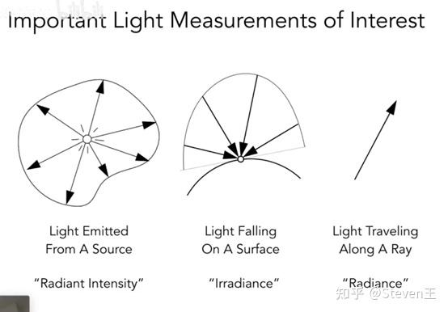

（6）辐射率和辐照度的区别：想象一个微小的平面，往每一个方向方向吸收光能，那么radiance就表示该平面沿着某一个方向上吸收到的光能，这个微小发光面吸收到的所有能量之和就是Irradiance，等于所有radiance的积分。Radiance是带有方向性的光亮度，Irradiance是不带有方向性的，各个方向上Radiance的积分之和：

***
# 5.BRDF(⭐⭐⭐)
（1）基本概念

BRDF(Bidirectional Reflectance Distribution Function)，译作双向反射分布函数，是一个用来描述物体表面如何反射光线的方程，表示了当给定一条入射光的时候，某一条特定的出射光线的性质是怎么样的。它的精确定义是出射光辐射率(Radiance)的微分和入射光辐照度(Irradiance)的微分之比。

（2）概念理解

入射光l 照到物体表面上，反射光线为v，那么反射光的亮度（辐射率）和入射光的能量(辐照度)会成一个比例，而这个比例就是BDRF。可以理解为，在某一个特定的角度观看某个点时，各个方向的入射光对该点的最终光亮度产生的贡献比例，其实它就是一些零点几的小数。

***
# 6.渲染方程(⭐)
（1）基本概念：渲染方程是一个描述光能在场景中流转的方程，它基于能量守恒定律，在理论上给出了一个完美的光能求解结果。其含义是：**在某个视点看向特定的位置x，看到的出射光亮度(辐射率)Lo等于x点的自发光亮度Le(辐射率)以及该点的反射光亮度之和，** 可以由以下公式表示：

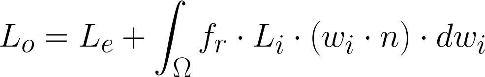
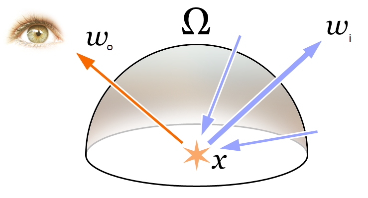

（2）概念理解：从某个视角看向某个特定点，光亮度等于该点自身的光亮度，加上从四面八方的入射光线照射到这一点，并且反射到该视角的光亮度之和，因为任何一条入射光线射到x点上可能都会产生视线方向的反射光线，所以需要对半球面做一个积分，而这个积分也恰好用到了BRDF的概念，也就是fr这个参数。W·n其实就是cosθ，θ是入射方向与表面法线的夹角，乘上这个系数的原因跟辐射率的概念相关(单位投影面积的辐射通量)，具体不再详细解释。

## 反射方程
而在实时渲染中，我们常用的反射方程，则是渲染方程的简化的版本，或者说是一个特例,其实就是除去了自发光的部分，只保留半球积分部分。

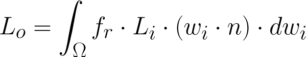

***
# 7.SSAA,MSAA(⭐⭐)

## 锯齿产生的原因
光栅化的时候，是以像素中心点是否被三角形覆盖来决定是否生成片段，因此有些片段覆盖了采样点就生成，有些没有覆盖就不生成，最终导致了锯齿现象。

## SSAA
最直接的抗锯齿方法就是SSAA（Super Sampling AA）。拿4xSSAA举例子，假设最终屏幕输出的分辨率是800x600, 4xSSAA就会先渲染到一个分辨率1600x1200的buffer上，然后再直接把这个放大4倍的buffer下采样致800x600。这种做法在数学上是最完美的抗锯齿。但是劣势也很明显，光栅化和着色的计算负荷都比原来多了4倍，render target的大小也涨了4倍。

## MSAA(这个喜欢考)
MSAA则很聪明的只是在光栅化阶段，判断一个三角形是否被像素覆盖的时候会计算多个覆盖样本，但是在pixel shader着色阶段计算像素颜色的时候每个像素还是只计算一次。例如下图是4xMSAA，三角形只覆盖了4个coverage sample中的2个。所以这个三角形需要生成一个fragment在pixel shader里着色，只不过生成的fragment还是在像素中央（位置，法线等信息插值到像素中央）然后只运行一次pixel shader，最后得到的结果在resolve阶段会乘以0.5，因为这个三角形只cover了一半的sample。现代所有GPU都在硬件上实现了这个算法，而且在shading的运算量远大于光栅化的今天，这个方法远比SSAA快很多。

说人话就是: 在光栅化阶段，判断三角形是否被像素覆盖时，会计算多个采样点，然后计算一个覆盖率；在片段着色阶段，每个像素仍然只计算一次颜色值，片段以像素中央来进行计算，只是最后的结果会乘上一个覆盖率；MSAA的高效性在于，他没有每个采样点都计算一次着色，而是每个像素只计算一次着色，最后乘上一个覆盖率；

 
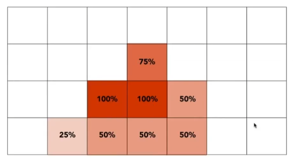

***
# 8.PBR(⭐⭐⭐)
[详情请看这篇文章](https://blog.csdn.net/poem_qianmo/article/details/85239398)
## PBR基础理念的概括：

**微平面理论**。微平面理论是将物体表面建模成做无数微观尺度上有随机朝向的理想镜面反射的小平面（microfacet）的理论。在实际的PBR 工作流中，这种物体表面的不规则性用粗糙度贴图或者高光度贴图来表示。

**能量守恒** 。出射光线的能量永远不能超过入射光线的能量。随着粗糙度的上升镜面反射区域的面积会增加，作为平衡，镜面反射区域的平均亮度则会下降。

**菲涅尔反射**。光线以不同角度入射会有不同的反射率。相同的入射角度，不同的物质也会有不同的反射率。万物皆有菲涅尔反射。F0是即0度角入射的菲涅尔反射值。大多数非金属的F0范围是0.02~0.04，大多数金属的F0范围是0.7~1.0。

**线性空间**。光照计算必须在线性空间完成，shader 中输入的gamma空间的贴图比如漫反射贴图需要被转成线性空间，在具体操作时需要根据不同引擎和渲染器的不同做不同的操作。而描述物体表面属性的贴图如粗糙度，高光贴图，金属贴图等必须保证是线性空间。

**色调映射**。也称色调复制（tone reproduction），是将宽范围的照明级别拟合到屏幕有限色域内的过程。因为基于HDR渲染出来的亮度值会超过显示器能够显示最大亮度，所以需要使用色调映射，将光照结果从HDR转换为显示器能够正常显示的LDR。

**物质的光学特性**。现实世界中有不同类型的物质可分为三大类：绝缘体（Insulators），半导体（semi-conductors）和导体（conductors）。在渲染和游戏领域，我们一般只对其中的两个感兴趣：导体（金属）和绝缘体（电解质，非金属）。其中非金属具有单色/灰色镜面反射颜色。而金属具有彩色的镜面反射颜色。即非金属的F0是一个float。而金属的F0是一个float3，如下图。

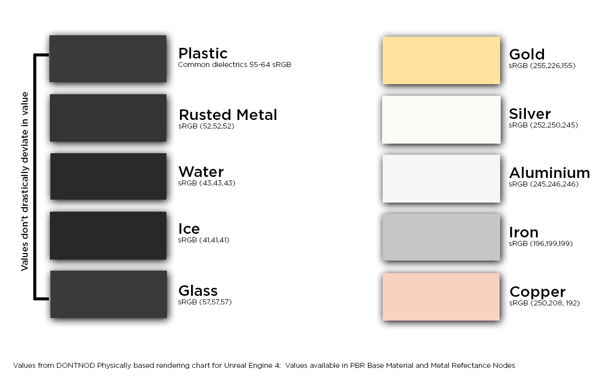

## PBR的基本概念

基于物理的渲染（Physically Based Rendering，PBR）是指使用基于物理的原理和微平面理论建模的着色/光照模型，以及使用从现实中测量的表面参数来准确表示真实世界材质的渲染理念。PBR的范畴包括三个方面：**基于物理的材质、基于物理的光照、基于物理适配的相机**。

## PBR的BRDF

一般使用一种被称为Cook-Torrance BRDF的模型

**(1)Cook - Torrance BRDF 兼有`漫反射`和`镜面反射`两个部分的反射：**

\(f_{r}=k_{d}f_{lambert} + k_{s}f_{cook - torrance}\)

这里的\(k_{d}\)是早先提到过的入射光线中被折射部分的能量所占的比率，而\(k_{s}\)是被反射部分的比率。BRDF 的左侧部分表示的漫反射部分，这里用\(f_{lambert}\)来表示，它被称为 Lambertian 漫反射，这和我们之前在漫反射着色中使用的常数因子类似，用如下的公式来表示：

\(f_{lambert}=\frac{c}{\pi}\)

c表示表面颜色。（举例来说，如果一个平面拥有以余弦为基础的表面（漫反射面），那么对于所有的入射光线\(\omega_{i}\)（除了一束以平面法向量n的方向入射的光线之外），出射光线的分布都将是相同的）。c除以\(\pi\)是为了对漫反射进行标准化，因为前面含有 BRDF 的积分方程是受\(\pi\)影响的（我们会在 IBL 的下激时候讨论这个问题）。这个 Lambertian 漫反射和我们之前经常使用的漫反射到底有什么关系？之前我们用表面法向与光照方向的量进行点乘，然后再将结果与平面颜色相乘得到漫反射参数，点乘依然还在，但是却不在 BRDF 之内，而都转变成为了\(f_{lambert}\)的公式中未被显式的\(\omega_{i}、\omega_{o}\)。目前存在着许多不同类型的模型来实现 BRDF 的漫反射部分，大多看上去都相当真实，但是相应的运算并非也非常的昂贵，Lambertian 漫反射模型已经足够应付大多数实时渲染的用途了。BRDF 的镜面反射部分要稍微更高级一些，它的形式如下所示：

\(f_{cook - torrance}=\frac{DFG}{4(\omega_{o} \cdot n)(\omega_{i} \cdot n)}\)

**(2)镜面反射部分(这是重点)**

\(f_{cook - torrance}=\frac{DFG}{4(\omega_{o} \cdot n)(\omega_{i} \cdot n)}\)

**D(n,h)为法线分布函数**(不应该译作正态分布函数)，描述这么多个微平面中，有多少个微平面的法线是正确朝向的，返回一个比例，代表了镜面高光部分；

**F(h,v)菲涅尔方程(⭐尤其是这个,最喜欢考)**，表示不同的入射角，反射率不同，返回一个反射光线所占的比例（反射率），代表了菲涅尔效应部分；

**G(n,v,l)几何函数**，表示微平面自成阴影的属性，返回一个未被遮蔽的表面的百分比，代表了几何遮蔽部分；

分母是校正因子，作为微观几何局部空间和宏观几何局部空间变换的校正。

***

# 9.Phong光照模型和Blin-Phong光照模型的区别？(⭐)

（1）Phong氏光照模型其实是**经验模型**，参数信息是通过经验得到的。Phong模型将物体光照分为三个部分进行计算，分别是：**漫反射分量、镜面高光和环境光**。其中，环境光分量是用来模拟全局光照效果的，其实就是在物体光照信息基础上叠加上一个较小的光照常量，用来表示场景中其他物体反射的间接光照。具体实现：环境分量，直接设置一个ambient分量，乘上光照颜色和物体颜色；漫反射分量，用光线到片段的向量与片段平面法线向量的点乘，乘上光的颜色和物体颜色；镜面分量，通过指数函数pow计算，有一个shininess分量，越大表示高光越尖锐，用到了视线方向和反射光线方向的点积。

（2）Blinn-Phong氏光照模型是对Phong氏光照模型的改进，**Phong模型在处理高光时会出现光照不连续的情况**。当光源和视点位于同一个方向时，反射光线跟观察方向可能大于90度，反射光线的分量就被消除了，所以出现高光不连续的现象。Blinn-Phong模型在处理镜面反射时不使用观察方向和反射光线的夹角来计算，而是引入了一个新的向量：**半程向量(Halfway vector)**。半程向量其实很简单，就是入射光线向量L和观察方向V的中间位置（角平分线）。Blinn-Phong求高光亮度的时候使用半程向量和法向量的点积来决定高光亮度。Phong是用反射光线和视线向量的点积来求高光亮度。

***
# 10.mipmap(⭐)
（1）提出背景：在一个场景内有很多物体，有的远有的近。远处的物体只占很少的片段（假设每个物体都有各自的纹理，且分辨率都很高的话），此时如果要从高分辨率的纹理中采样，会比较困难，因为一个很小的物体，一个像素映射到纹理上会占据很大一块，包含了很多个纹理像素，不好采样，因此引出了多级渐远纹理(mipmap)技术。

（2）原理：将纹理划分为不同大小分辨率的纹理图集，每次缩小1/2划分，根据物体的大小，来对不同级别的纹理进行采样。对远处的物体，采用低分辨率的纹理，对于近处的物体，采用高分辨率的纹理

在渲染前先对贴图做预处理，对边长为二次幂的正方形贴图，每次取其边长的一半，做新的分辨率更低的贴图,称为l层，就等于是已经提前做好了一个范围内的像素求值并存储在一张新的贴图内。

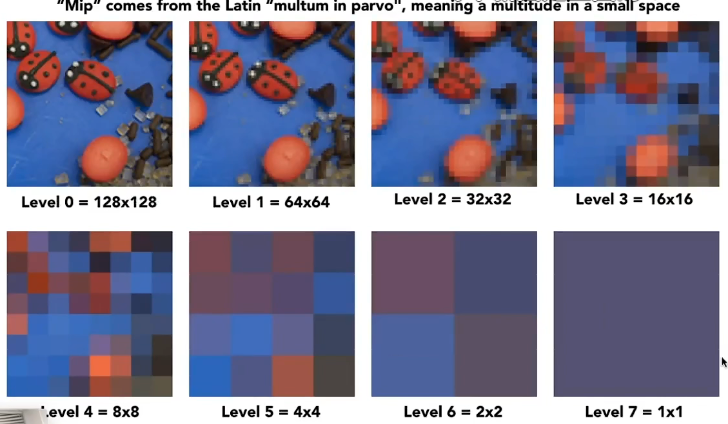

可以得出的是，这样做只会增大原有图片内存的三分之一(准确来讲是1.33倍(3的循环))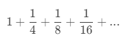

***
# 11.空间加速结构&算法

## AABB
对于光追的加速，任意条光线对所有几何体都进行判定是很慢的，可以通过包围盒进行碰撞检测的加速。

我们可以使用一些简单的形体将几何体包围起来，称为包围盒，对于一条光线，可以先检测它是否与包围盒碰撞，如果有碰撞，再检测其与几何体的碰撞。

把物体放在一个三个轴向对其的包围盒内(一个矩形)，如果光线无法与包围盒相交，那必然也无法和包围盒里面的物体相交，这样就可以省略大量不必要的求交计算；而且光线与包围盒的求交计算与具体的物体求交相比，速度是快得很多的；使用AABB的好处，计算可以简化，很容易计算出t，只需要用轴分量计算。

## Uniform Grids(均匀格子)
在AABB里面划分小格子，然后预处理将物体包含的格子做标记；接着遍历光线上的格子，在计算光线与标记过的格子中的物体是否相交。这样可以省略对那些不包含格子的物体进行求交计算，进一步提高求交速度

步骤简单来说就是:
- 先找出场景的包围盒
- 将其划分成统一的网格
- 储存网格与物体表面相交的信息

## 二叉树、四叉树、八叉树、KD树

照空间进行划分，将对象组织称为二叉树/四叉树/八叉树/KD树的数据结构：

## BVH(层次包围盒)

基于对象进行划分，目前得到最广泛的应用

考虑有一组物体，先求出他们的包围盒，然后将这组物体分为两部分，再重新求每组的包围盒，这样进行递归计算，直到包围盒满足条件（为空或者物体数量少）。将物体信息存储在叶子节点上。

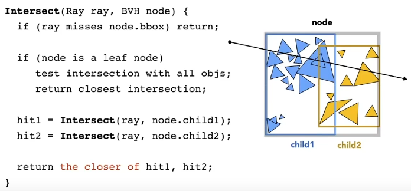

**划分方式**:

- 每次选择一个维度进行划分
- 启发式1：总是选择最长的轴进行划分
- 启发式2：将中间的物体作为分界线进行划分（将三角形重心坐标作为值，用O(n)快速选择算法选择出中位数，进行划分）

***
# 12.MVP矩阵的作用及推导(⭐⭐⭐)
模型矩阵M(Model)：将局部坐标变换到世界坐标；

观察矩阵V(View)：将世界坐标转换为观察坐标，或者说，将物体的世界坐标，转换为在相机视角下的坐标；

投影矩阵P(Projection)：将顶点坐标从观察空间变换到裁剪空间(clip space) ，后续的透视除法操作会将裁剪空间的坐标转换为标准化设备坐标系中（NDC）。

`(既然考到MVP变换,大概率是要问你view和Project的推导的)`

## view变换的推导
view变换的目的是将相机从某一位置的摆放给放到标准位置(中心为原点,向上方向为+y,向-z方向看)上去

也就是说将
1. 相机的中心移动到世界坐标原点,
2. 将相机的 *g* (朝向方向)移动到-Z轴,
3. 将相机的 *t* (向上方向)移动到+Y轴,那*g*叉乘*t*自然也就对应了+X轴

移动到原点的矩阵好算

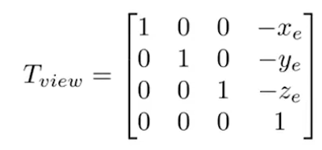

但是后面两步就麻烦了,你可以想想无论是t还是g的矩阵表示肯定都是数字杂乱的,我的意思就是你需要的计算可能是这样的一个过程$ \left( \dfrac{1}{3},\ \dfrac{\sqrt{3}}{3},\ \dfrac{\sqrt{2}}{3} \right) $ ----变为----> (0,0,-1)(这个例子是不准确的,实际肯定是矩阵计算,意思到了就行),这样不好算的

所以我们都是**先计算标准轴对应到相机的各个向量的矩阵再取其逆矩阵(这步就是推导的关键)**,也就是说算(0,0,-1)----变为----> $ \left( \dfrac{1}{3},\ \dfrac{\sqrt{3}}{3},\ \dfrac{\sqrt{2}}{3} \right) $ (这个也是,意会一下就行了,正确矩阵表示在下面)

#### 逆旋转矩阵 \( R_{\text{view}}^{-1} \)  
\[
R_{\text{view}}^{-1} = \begin{bmatrix} 
x_{\hat{g} \times \hat{t}} & x_t & x_{-g} & 0 \\
y_{\hat{g} \times \hat{t}} & y_t & y_{-g} & 0 \\
z_{\hat{g} \times \hat{t}} & z_t & z_{-g} & 0 \\
0 & 0 & 0 & 1 
\end{bmatrix}
\]  

#### 正旋转矩阵 \( R_{\text{view}} \)（由逆变换转置推导，因旋转矩阵逆 = 转置）  
\[
R_{\text{view}} = \begin{bmatrix} 
x_{\hat{g} \times \hat{t}} & y_{\hat{g} \times \hat{t}} & z_{\hat{g} \times \hat{t}} & 0 \\
x_t & y_t & z_t & 0 \\
x_{-g} & y_{-g} & z_{-g} & 0 \\
0 & 0 & 0 & 1 
\end{bmatrix}
\]  

## Project变换的推导

分两种: 
### 正交投影矩阵
正交投影矩阵的视锥体是一个长方体[l,r][b,t][f,n]，我们要把这个长方体转换到一个正方体[-1,1][-1,1][-1,1]中，如图。

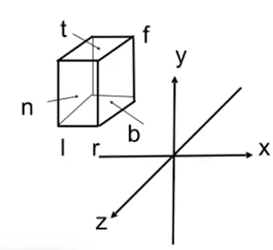

第一步平移，计算出长方体的中心点为[(l+r)/2,(b+t)/2,(f+n)/2]，然后将中心点移动到原点

第二步缩放，例如从[l,r]缩放到[-1,1]，缩放系数为2/(r-l)，所以矩阵为

这种简单,重要的是下面这种

### 透视投影矩阵

透视投影矩阵的视锥体是一个四棱锥的一部分，其中近平面为z=n，远平面为z=f，我们要把这个视锥体转换到一个正方体[-1,1][-1,1][-1,1]中，可以先把远平面压缩，把视锥体压缩成一个长方体，然后再通过正交投影矩阵就可以变换到正方体中，如图。

在把视锥体压缩成长方体的过程中，我们规定三个原则
1. 近平面的所有点坐标不变
2. 远平面的所有点坐标z值不变 都是f
3. 远平面的中心点坐标值不变 为(0,0,f)

然后我们假设视锥体内的任意一点(x,y,z)，压缩以后的xy坐标应该与近平面上对应的点相同，如图解相似三角形可以得到 (y->ny/z) (x->nx/z)

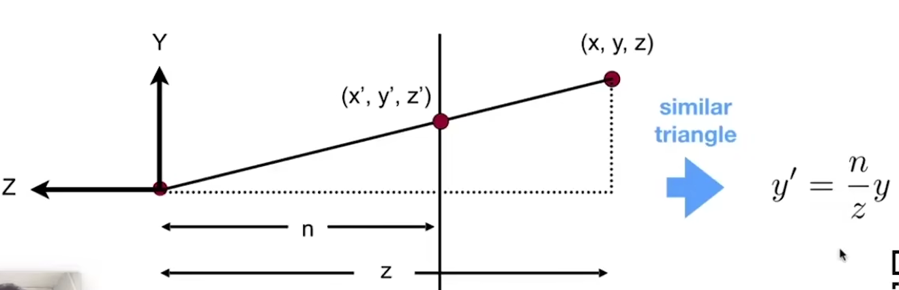

故对于(x,y,z,1)一点，它在视锥体压缩以后坐标应该为(nx/z,ny/z,unknow,1)。

z值我们还不知道，这里先不讨论。

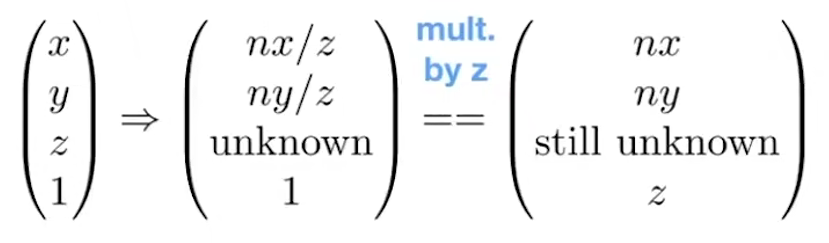

也就是说我们最终要算的如下图

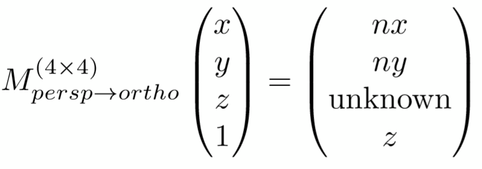

别管那么多,先给矩阵写出来

OK,我们再思考一下,上面这个矩阵变换总归是要满足这整个视椎体变向正方体的,我们再来观察近平面和远平面

**近平面上任一点都不会发生变化,那结合上面的可得**

也就是说,上面我们未知的那第三行可得以下等式,因为x和y没变,所以都为0,所以只剩下A和B未知了,其他都已知

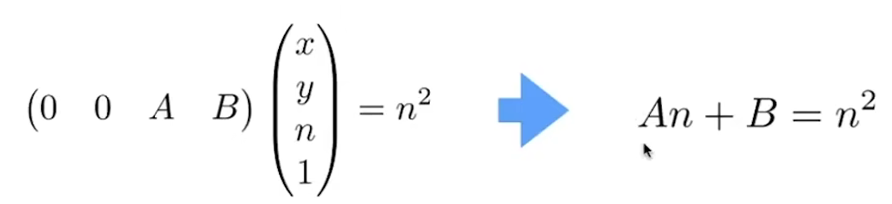

**远平面上任一点的Z值是没有改变的,我们取远平面的中心点**

结合上面的近平面和远平面,终于可以算出那未知的第三行是什么了

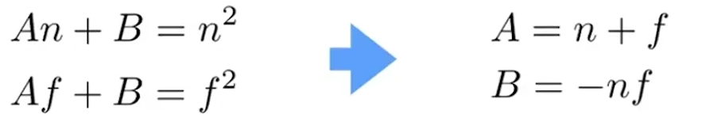
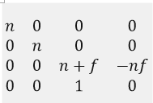

OK了,视椎体已经被我们压成长方体了,后面再做一次正交投影就行了

***
# 13.什么是齐次坐标，齐次坐标有什么作用？

（1）所谓齐次坐标就是为矢量或者矩阵增加一个维度，2D平面使用3维向量和三维矩阵，3D空间使用4维向量和4维矩阵；额外的坐标值是任意的，可以看作缩放或者权重。

（2）三维矩阵可以表示旋转和缩放，它们相乘的结果是正确的，但是平移变换不能加到三维矩阵中的相乘去表达，只能将矩阵相乘的结果加一个三维向量；引入齐次坐标之后会增加一个维度，变为四维矩阵，多出来的一维向量用来表示平移，那么就可以在一个矩阵中统一所有的操作：平移、旋转、缩放。
***
# 14.欧拉角、矩阵、四元数表示旋转的区别和优缺点(⭐⭐⭐)
1. 欧拉角：定义了绕着三个坐标轴的旋转角，来确定刚体的旋转位置的方式，包括俯仰角pitch，偏航角yaw和滚动角roll；它的优点是比较直观，而且单个维度上的角度也比较容易插值；缺点是它不能进行任意方向的插值，而且会导致万向节死锁的问题，旋转的次序对结果也有影响

2. 矩阵：优点是不受万向节死锁的影响，可以独一无二的表达任意旋转，并且可以通过矩阵乘法来对点或矢量进行旋转变换；现在多数CPU以及所有GPU都有内置的硬件加速点积和矩阵乘法；缺点是不太直观，而且需要比较大的存储空间，也不太容易进行插值计算。

3. 四元数：四元数的好处是能够串接旋转；能把旋转直接作用于点或者矢量；而且能够进行旋转插值；另外它所占用的存储空间也比矩阵小；四元数可以解决万向节死锁的问题。

***
# 15.如何判断一个点在三角形(矩形、扇形)内(⭐⭐)

1. 面积法，点划分的三个小三角形面积是否等于大三角形；

2. 叉乘法，沿逆时针方向，三角形两两顶点构成三个向量，比如AB,BC,CA，分别用这三个向量与起点和P的交点构成的向量求叉乘，如ABxAP, BCxBP, CAxCP，由右手定则，如果三个结果都是正的，说明这个点都在向量的左边；可以推导得出这个点在三角形内，否则只要有一个是负数，就说明在右手边，在三角形外了。

***
# 16.如何判断一条光线是否与一个三角形相交
1. 先判断光线是否和三角形所在的面相交，再判断这个交点是否在三角形内；
2. 用Moller Trumbore算法
    - 原理是如果一个点在三角形内，就能用重心坐标系去表示这个点；重心坐标公式，α = 1 – β - λ；带入方程，有3个未知数（β，λ，t），由因为都是三维变量，可以得到三个等式；利用克拉默法则，线性代数的知识，就可以求解出这三个未知数；解出来，判定t是否合理，t > 0，然后α、β和λ三个系数都是非负的，就是有解，在三角形内。
***
# 17.平滑着色,高德洛着色,冯氏着色的区别？

- 平滑着色(flat-shading)是对每个三角形计算着色，三个顶点构成的三角形采用同一种颜色；
- 高德洛着色(Gouraud-shading)是对每个顶点计算颜色，在三角形内的每个点，求线性插值后的结果（如果有镜面高光会存在失真现象）；
- 冯氏着色(phong-shading)是逐片段计算的，会在根据输入的顶线信息在光栅化阶段插值得到各个片段的信息，然后在片段着色器中利用位置、法线、纹理坐标等信息计算每个片段的光照信息(对每个片段进行光照计算)
***
# 18.蒙特卡洛积分
[看这个](https://learnopengl-cn.github.io/07%20PBR/03%20IBL/02%20Specular%20IBL/)

[或者去看GAMS101的Ray tracing的第四讲](https://www.bilibili.com/video/BV1X7411F744?spm_id_from=333.788.videopod.episodes&vd_source=e5ff09f1c2b416e099232ca31ec5028d&p=16)

直观一点解释:
对于[a,b]这个区间,随便取一点x都能找到对应的f(x),把该f(x)当做整个函数的f(x),那么就有高为f(x),长为(b - a)的矩形,以此来代表整个函数的积分,这样对于[a,b]这个区间取所有x的可能得到的积分再求平均,这种积分方法就是蒙特卡洛积分

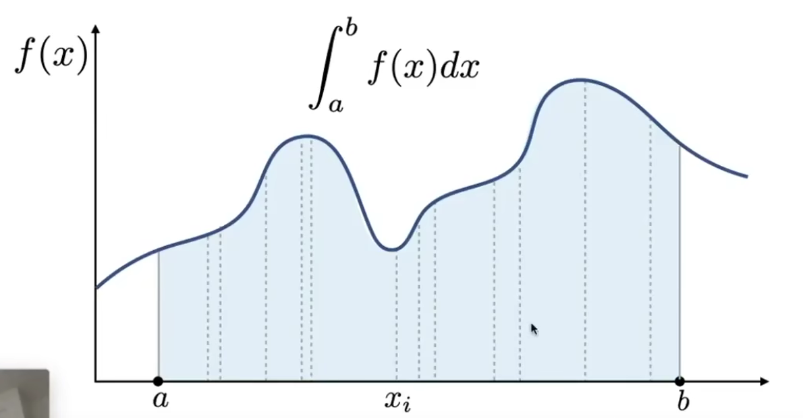

蒙特卡洛积分只需要在积分域内以一个PDF(概率密度函数)采样,采样的样本对应的f(x)是多少,概率密度P(x)是多少,两个相除求平均

***
# 19.图元、片元和像素

**生成先后顺序**
顶点→图元→片元→像素

- **图元**：由顶点组成的 “基础几何单元”，是 3D 模型最原始的 “形状描述”，一个顶点、一条线段、一个三角形或者多边形都可成为图元。想象你要画个三角形：先在纸上点 3 个点（顶点），再把点连起来，这 “连起来的形状” 就是 图元 。
- **片元**：在图元经过光栅化阶段后，被分割成一个个像素大小的基本单位，其实已很接近像素，但还不是。片元包含比 RGBA 更多信息，如可能有深度值、法线、纹理坐标等。片元需通过一些测试（如深度测试）后，才最终成为像素，会有多个片元竞争同一像素，测试筛选出合适片元，丢弃法线和纹理坐标等无用信息后成为像素, 所以你可以把片元理解为"候选人",每个像素对应多个候选片元等着挑。
- **像素**：最终呈现在屏幕上，包含 RGBA 值的图像最小单元 。

***
# 20.路径追踪

**基本思想:**
路径追踪的基本思想是从视点发出一条光线，光线与物体表面相交时根据表面的材质属性继续采样一个方向（选择一个随机方向），发出另一条光线，如此迭代，直到光线打到光源上（或逃逸出场景），然后用蒙特卡洛的方法，计算其贡献，作为像素的颜色值；由于单条光路的蒙特卡洛积分肯定会不准确，产生很多噪点，所以一般是单个像素发射多条光线进行路径追踪，一条路径就是视点和场景中各个物体反射交点的连线。

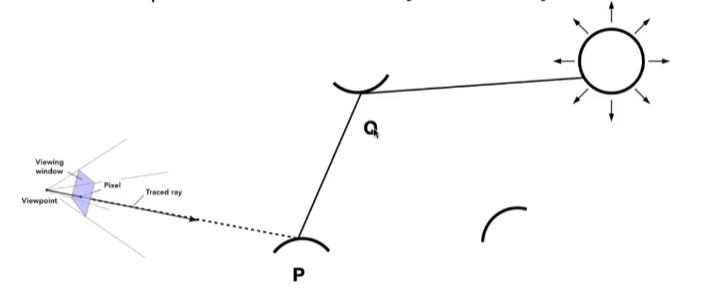

**核心思路:**
先用俄罗斯轮盘赌算法(RR)，决定是否发出一条光线，若发出，则随机采样一个服从pdf分布的光线方向，发出该条光线，如果光线与光源相交，表示直接光照，直接用蒙特卡洛积分计算结果，再除以一个P_RR，如果是物体，递归地计算交点的着色结果(以目前发射的光线的反方向作为出射方向)，把着色结果当作一个光源的亮度，进行蒙特卡洛积分计算，同样除以P_RR：
***
# 21.球谐函数
[想深入了解看GAMES202 Lecture06](https://www.bilibili.com/video/BV1YK4y1T7yY/?p=6&vd_source=e5ff09f1c2b416e099232ca31ec5028d)

先说它在全局光照技术里是干啥的: 

球谐函数在全局光照中主要作为球面正交基函数，用于高效表示和计算与方向相关的光照分布（如表面某点接收到的辐射度、光线反射 / 折射的方向分布等）；通过将高维的方向函数投影到低阶球谐系数，它能大幅压缩数据量，简化光线多次反弹时的复杂积分运算（如间接光照的传递），从而降低全局光照求解的计算成本，实现高效的实时或离线渲染。

说简单点就是: 全局光照的核心就是渲染方程,
\[ L_o(\omega_o) = L_e(\omega_o) + \int_{\Omega^+} f_r(\omega_i, \omega_o) \cdot L_i(\omega_i) \cdot (\omega_i \cdot \mathbf{n}) \, d\omega_i \]
（\(L_o\)是出射光，\(L_i\)是入射光，\(f_r\)是 BRDF，积分是对所有入射方向\(\omega_i\)求和）

而这个积分计算极为复杂,而其中的BRDF是双球面函数,入射光分布是球面函数,它们都用球谐函数去低阶近似,渲染方程的求解难度大幅降低,就能高效算出物体表面该亮还是暗

**球谐函数的快速理解**

先从傅里叶变换说起,对于一个周期函数,傅里叶变换的核心思想是将它分解为一系列简单三角函数（正弦 / 余弦函数）的叠加,本质是将函数从 “时间域” 转换到 “频率域”,如下图,你别管看不看得懂,你只要知道他把周期函数拆成很多三角函数了,

以上和全局光照没有关系,只是用于理解球谐函数
那对照上面,球谐函数就是对于一个球面函数来说,分解成了各个各个球谐基函数

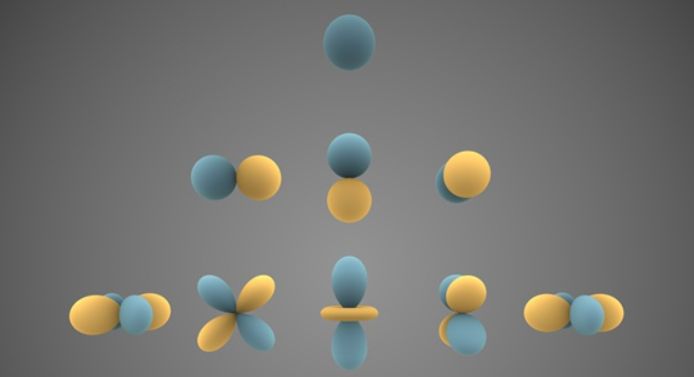

